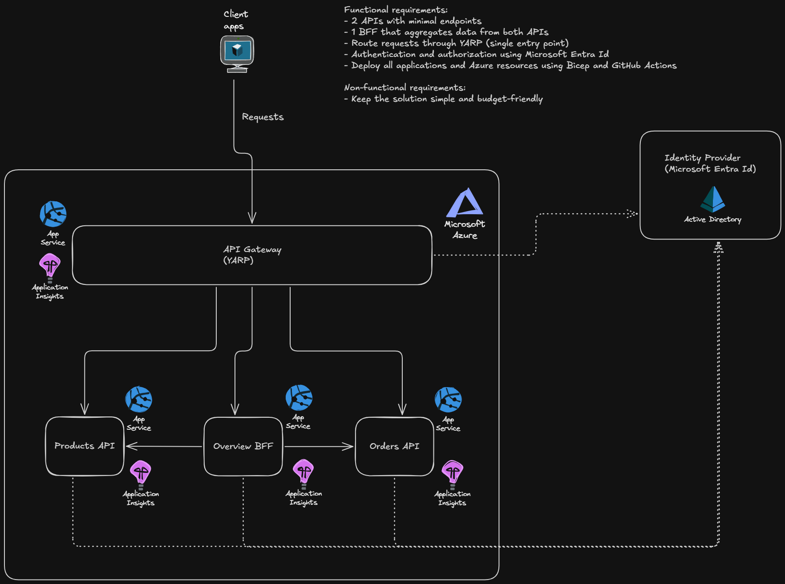

# YarpApiGateway

A learning project focused on YARP, Azure App Service, Bicep, and GitHub Actions.

## System Architecture



The system consists of four .NET 10 applications:
- **YARP Gateway** – single public entry point, reverse proxy
- **Orders API** – tiny backend API returning Bogus-generated order data
- **Products API** – tiny backend API returning Bogus-generated product data
- **Overview BFF** – aggregates data from both backend APIs

The project is intentionally kept simple for learning. No database is used; all data is generated in-memory. 

## Request Flow

All requests go through YARP:

> Client → YARP → BFF / API → Response

The Overview BFF calls both backend APIs to build the overview response.

Backend APIs cannot be called directly. YARP adds a required internal header when forwarding requests.

## API Endpoints

| Endpoint           | Responsibility               |
|--------------------|------------------------------|
| `GET /api/orders`  | Get orders                    |
| `GET /api/products` | Get products                |
| `GET /api/overview` | Get aggregated order summary |
| `GET /api/health`  | Health check                 |

YARP routes these endpoints to the appropriate service.

## Authentication & Authorization

Microsoft Entra ID is used for authentication and authorization.

Flow:
- Client gets an access token 
- Sends token to YARP. 
- YARP validates the JWT
- Backend APIs validate again 

Each service has its own scope:
- ```Orders.Read```
- ```Products.Read```
- ```Overview.Read```

Postman is configured as an Entra ID application for testing.

## Azure

All four applications run as Azure App Services under one App Service Plan.

Resources:
- 4 App Services
- 4 Application Insights
- 1 Shared Log Analytics Workspace

Infrastructure is deployed with Bicep.

## CI/CD

GitHub Actions builds and deploys the applications to Azure.

GitHub authenticates to Azure using a managed identity with a federated credential.

The one-time identity and Entra ID setup is handled with Azure CLI and GitHub CLI within a PowerShell script.